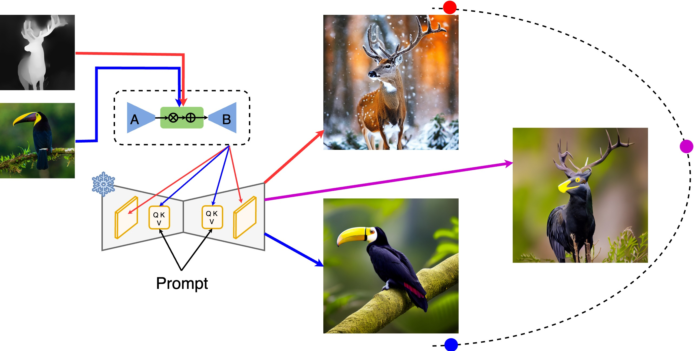

# 

<p align="center">
 <h2 align="center">Conditional LoRAdapter for Efficient 0-Shot Control & Altering of T2I Models</h2>
 <p align="center"> 
 Nick Stracke<sup>1</sup> · Stefan A. Baumann<sup>1</sup> · Josh Susskind<sup>2</sup> · Miguel A. Bautista<sup>2</sup> · Björn Ommer<sup>1</sup>
 </p>
 <p align="center"> 
    <sup>1</sup> <b>CompVis Group @ LMU Munich</b> <br/>
    <sup>2</sup> <b>Apple</b>
 </p>
</p>
<p align="center">
 <b>ECCV 2024</b>
</p>


[](https://compvis.github.io/LoRAdapter/)
[](https://arxiv.org/abs/2405.07913)

This repository contains an implementation of the paper "CTRLorALTer: Conditional LoRAdapter for Efficient 0-Shot Control & Altering of T2I Models".

We present LoRAdapter, an approach that unifies both style and structure conditioning under the same formulation using a novel conditional LoRA block that enables zero-shot control.
LoRAdapter is an efficient, powerful, and architecture-agnostic approach to condition text-to-image diffusion models, which enables fine-grained control conditioning during generation and outperforms recent state-of-the-art approaches.



## 🔥 Updates
- Implemented [B-LoRA](https://b-lora.github.io/B-LoRA/) implicit content and style disentangle using LoRAdapter
- Released Code and Weights for inference

## 💪 TODO
- [x] Add training Code
- [ ] Add more structure conditioning checkpoints (including SDXL)
- [ ] Experiment with SD3


## Setup

Create the conda environment

`conda env create -f environment.yaml `

Activate the conda environment

`conda activate loradapter`

## Weights

All weights are available on [HuggingFace](https://huggingface.co/kliyer/LoRAdapter/tree/main).

For ease of you, you can also use the provided bash script `download_weights.sh` to automatically download all available weights and place them in the the right directory.


## Usage
Sampling works according to the following schema:
```
python sample.py experiment=<check ./config/experiments>
```
All currently available experiments are listed in `/config/experiments`. Feel free to adjust the configs according to you own needs.

### B-LoRA
Sampling using the [B-LoRA](https://b-lora.github.io/B-LoRA/) LoRAdapter is possible using the config `sample_b-lora_sdxl.yaml`. By default this will condition on both content and style of the image. For conditioning on _only_ content or _only_ style, change the `adaption_mode` to either `b-lora_content` or `b-lora_style`. Also set `ignore_check` to true as we are only loading the checkpoint partially.

For best results provide information about the missing modality via the text prompt or using another LoRAdapter.


## 🎓 Citation

If you use this codebase or otherwise found our work valuable, please cite our paper:

```bibtex
@misc{stracke2024loradapter,
  title={CTRLorALTer: Conditional LoRAdapter for Efficient 0-Shot Control & Altering of T2I Models},
  author={Nick Stracke and Stefan Andreas Baumann and Joshua Susskind and Miguel Angel Bautista and Björn Ommer},
  year={2024},
  eprint={2405.07913},
  archivePrefix={arXiv},
  primaryClass={cs.CV}
}
```
